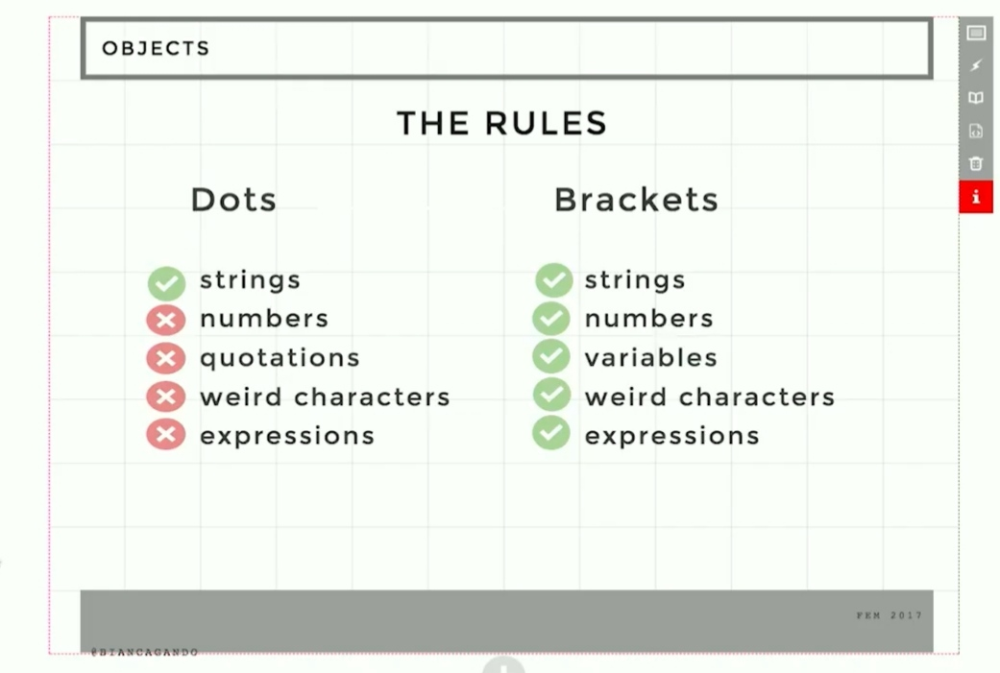

# Intermediary Javascript Course

## O que aprendi?
- O que são objetos em Javascript e como interagem entre si
- O que são arrays e como interagir com eles
- O que são métodos e propriedades de um objeto, sua chave e seu value
- Escopo: Block Scope x Global Scope. Let x Var
- Estrutura de dados
- As diferentes formas de loopar array x object, for() e for...in
- Os principais métodos do array. forEach, map, filter e reduce
- Nesting: List Transforms e como navegar por objetos com várias camadas
- Desestruturação: Como coletar elementos Deep Nested em uma estrutura de dados
- Projecting: Como transformar um value de uma estrutura de dados em outra estrutura de dados
- Funções em Javascript: Definição, Nome, Invocação, Argumentos, Parâmetros, Body, Return e Side Effects
- High-Order Functions e Callbacks. Funções que retornam funções
- Functional Utilities: curry e composing
- Advanced Scope: O que são Closures e como utilizar

## PS: Esse readme é um grande rascunho de estudos

## Anotações sobre as aulas:
### Main Topics:
#### Objects and Arrays
#### List Transformations
#### Array Methods

- "functional programming é sobre os verbos"
- "object oriented programming é sobre os substantivos"
- OO vc pensa nas coisas.. isso é um laptop, isso é uma mesa
- funcional vc pensa nas ações. Abrir e fechar uma porta 
- Libraries:
- Rodash
- Underscore
- Ramda

- Rodash e Underscore são utility libraries que dao pequenas funções que ajudam bastante a transformar data, loop filter, etc
Ramda é uma versão mais hardcore disso

### vantagem sobre a OO:
- na funcional se fazem funções puras que não tem side effects, e fazendo isso o código fica muito mais fácil de testar
- e mais fácil de confiar
- porém, se vc ta desenvolvendo web, vc tem que ter side effects. DOM Manipulation, todas essas coisas são side effects
-uma pure function tem input e output
-não altera nenhuma outra data fora do escopo daquela função
- o que torna fácil de testar e isso é ótimo
- mas no mundo real não é o que fazemos, não dá pra fazer 100% puramente funcional
- e as pessoas ficam doidas. O código de um programador funcional hardcore pode ser assustador

TUDO que usar um . em javascript é objeto
console.log  (log é método)
.then
array.push

primitive values get passed by value
(string, number, boolean, null, etc)
non primitive values get passed by reference 
(array, object, function)

- arrays are just objects

no javascript vc usa [] nos arrays simplesmente porque é um número, e o que se espera pra acessar um elemento no objeto é uma string
n da pra fazer array.0
array.name da

em [] aparentemente é número ou nome de variável
Poderia ser uma string mas ai precisa de "aspas" 
plea = "wouldShe"
person[plea] = "she would never"

só pode usar dot notation com caracteres "não estranhos"
basicamente aquilo que se permite declarar como variavel
numero n pode ser variavel
acho q eh só string alfabeto caracteres msm

- array.push(5) é um método
- array.length é uma propriedade

### o que o array tem que o torna um objeto especial:
a propriedade .length
essa propriedade computa índices numéricos
índices numéricos são diferentes de propriedades em um array porque um array captura esses índices e vai calcular o length
se tem ordem, podemos fazer reverse, sort, e qualquer alteração na ordem
isso é interessante que o objeto convencional não tem
é muito mais fácil rodar um loop por um array
ps: alguns dev tools em console.log podem esconder as propriedades do array que não são índices , mostrando apenas os números ordenados
para acessar a propriedade diretamente se usaria ponto, como se usa para ver o array.length
as propriedades do array não fazem parte da contagem do index
então vc pode atribuir um
Array.arroz = União 
Array.feijão = Fradinho
Array.carne = Picanha
Array.leite = Leitissimo
e no fim do dia isso não aumenta a quantidade de elementos contados no array

### pq usar array e não objeto?
é bom quando quer manipular uma lista de objetos que são todos da mesma propriedade
exemplo:
clue.weapons = [];
clue.weapons.push('Katana', 'Taco de sinuca', 'Marreta', 'Panela', 'Soqueira', 'Chifre de boi', 'Faca de cozinha', 'Chave de Fenda', 'Estilingue');
um array tá mais pra uma lista de uma propriedade específica
um objeto tá mais pra um documento cheio de propriedades diferentes
mas eles podem se combinar
vc pode fazer um array de objetos
a exemplo aqui, cada elemento desse array poderia ser um objeto.
Objeto katana teria tamanho X, cor Y, marca Z, etc...

- não dá pra dar .push em object. Só pode dar push em array
  

## Um Compilado organizado desse curso e com exemplos de código se encontra no meu servidor do discord.